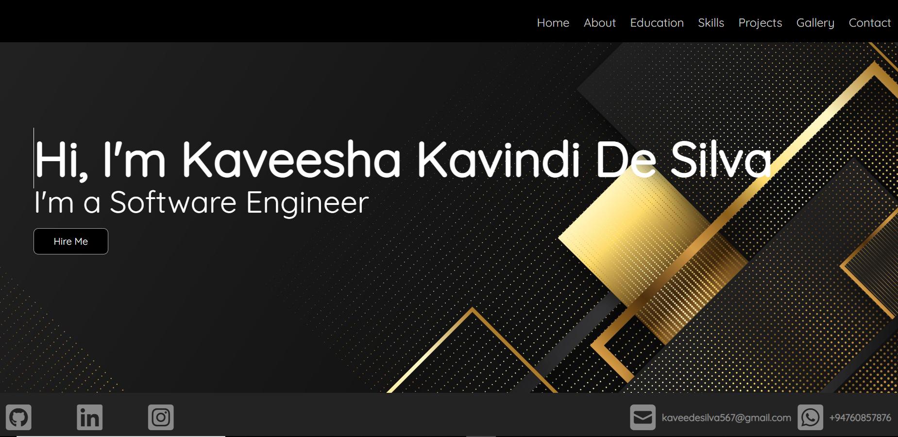
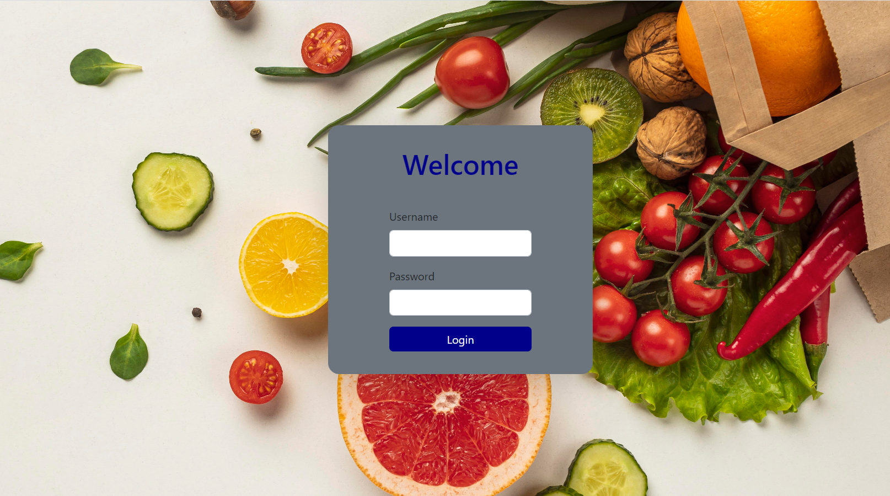

<!--
*** Thanks for checking out the Best-README-Template. If you have a suggestion
*** that would make this better, please fork the repo and create a pull request
*** or simply open an issue with the tag "enhancement".
*** Don't forget to give the project a star!
*** Thanks again! Now go create something AMAZING! :D
-->

<!-- PROJECT SHIELDS -->
<!--
*** I'm using markdown "reference style" links for readability.
*** Reference links are enclosed in brackets [ ] instead of parentheses ( ).
*** See the bottom of this document for the declaration of the reference variables
*** for contributors-url, forks-url, etc. This is an optional, concise syntax you may use.
*** https://www.markdownguide.org/basic-syntax/#reference-style-links
-->

<!-- PROJECT LOGO -->
 

  

<h1 align="center">MY PROFILE PROJECT</h1>

  

    This includes my protofolio!
     

## About The Project

<b>Hi,I'm Kaveesha Kavindi De Silva and this is a protofolio web site project.</b>

### Site Map

[https://www.gloomaps.com/QFiRKGZeKe](https://www.gloomaps.com/QFiRKGZeKe)

### Wire Frame

[https://wireframe.cc/wPQJip](https://wireframe.cc/wPQJip)

### Mockup

[https://www.figma.com/file/gQC4usAaBEk8t3RYNF12Tw/Untitled?node-id=0%3A1](https://www.figma.com/file/gQC4usAaBEk8t3RYNF12Tw/Untitled?node-id=0%3A1)

### Web Site

[http://kaveeshadesilva.epizy.com/](http://kaveeshadesilva.epizy.com/)

 
Used Technologies
 
==================
 
* Html
 
* CSS
 
* Java Script
 
* Intellij Idea
 
* Fontawesome

#        ************ POS System ************

🗺 Site Map URL : https://www.gloomaps.com/xyW3lJPtQd

🖼 Wire Frame URL : https://wireframe.cc/Dl5lMW

🏝 Mock-up URL : https://www.figma.com/file/IqrH5tcJkZl1KFDX9SSP10/Untitled?node-id=0%3A1

💻 Project URL : https://github.com/Kaveesha-Kavindi-De-Silva/My-Portfolio/tree/master/assignments/CSS/Frameworks/POS

 
Used Technologies
 
==================
 
* Html
 
* CSS
 
* Java Script
 
* Bootstrap
 
* jQuery
 
* Intellij Idea
 

## For More Information, Please Check Out or Contact Me Via

   &nbsp;&nbsp;

   &nbsp;&nbsp;

   &nbsp;&nbsp;

   &nbsp;&nbsp;

 

  :heart_eyes: Thanks for watching my profile! Have a nice day! :wink:  
  &copy; 2022 Kaveesha Kavindi De Silva

